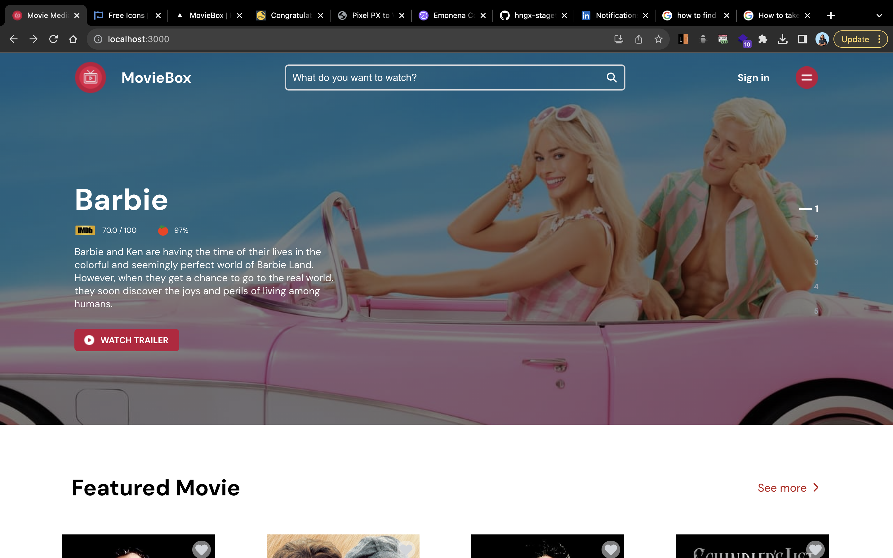

# 📝 Table of Contents <a name="readme-top"></a>

- [📝 Table of Contents ](#-table-of-contents-)
  - [🎥 Movie Box ](#-movie-box-)
  - [⚙️ Built With ](#-built-with-)
    - [⚙️ Tech Stack ](#️-tech-stack-)
    - [💡 Key Features ](#-key-features-)
  - [💻 Preview ](#-preview-)
  - [🔗 Live Link ](#-live-link-)
  - [💻 Getting Started ](#-getting-started-)
    - [Setup](#setup)
    - [Install](#install)
    - [Usage](#usage)
  - [👥 Authors ](#-authors-)
  <!-- - [🔭 Future Features ](#-future-features-)
  - [🤝 Contributing ](#-contributing-) -->
  <!-- - [⭐️ Show your support ](#️-show-your-support-) -->
  <!-- - [❓ FAQ ](#-faq-) -->
  <!-- - [🙏 Acknowledgments ](#-acknowledgments-) -->

## 🎥 Movie Media <a name="movie_box"></a>

> `MovieMedia is a movie discovery web application that allows users to search for movies, view details about them, and save their favorite movies.

## ⚙️ Built With <a name="built-with"></a>

### ⚙️ Tech Stack <a name="tech-stack"></a>

> Here are the tech stacks applied in this project.

<details>
  <summary>Language</summary>
  <ul>
    <li><a href="https://www.typescriptlang.org/">Typescript</a></li>
  </ul>
</details>

<details>
  <summary>Frameworks</summary>
  <ul>
    <li><a href="https://react.dev/">React</a></li>
<li><a href="https://chakra-ui.com/
">Chakra-UI</a></li>
  </ul>
</details>

<p align="right">(<a href="#readme-top">back to top</a>)</p>

### 💡 Key Features <a name="key-features"></a>

> The following are the key features of the app

- View list of movies
- Save favorite movie
- Watch Movie Trailer
- Discover movies via search

<p align="right">(<a href="#readme-top">back to top</a>)</p>

## 💻 Preview <a name="preview"></a>



## 🔗 Link  <a name="live-endpoint"></a>

[MovieMedia](https://movie-media.vercel.app/)

<p align="right">(<a href="#readme-top">back to top</a>)</p>

<!-- GETTING STARTED -->

## 💻 Getting Started <a name="getting-started"></a>

### Setup

Clone this repository:

```sh
  git clone https://github.com/Solexi/movie-media.git
  cd movie-media
```

### Install

Install this project with:

```sh
  npm install
```

### Usage

To run the project, execute the following command:

```sh
  npm run start
```
- You can use the app at [http://localhost:3000/](http://localhost:3000/) on your browser. 

<p align="right">(<a href="#readme-top">back to top</a>)</p>

## 👥 Authors <a name="authors"></a>

👤 **Sophia Ezeh(Solexi)**

[](https://github.com/Solexi/)
[](https://www.linkedin.com/in/sophia-ezeh-9884b6215/)
[](https://twitter.com/sophix_ezeh/)

[](mailto:ezehsophia4321@gmail.com)

<!-- ## 🔭 Future Features <a name="future-features"></a>

> The following are features to be expected in the future

- [ ] **Stream a movie**

<p align="right">(<a href="#readme-top">back to top</a>)</p> -->

<!-- ## 🤝 Contributing <a name="contributing"></a>

Contributions, issues, and feature requests are welcome!

Feel free to check the [issues page](../../issues/).

<p align="right">(<a href="#readme-top">back to top</a>)</p>

## ⭐️ Show your support <a name="support"></a>

Give a ⭐️ if you like this project!

<p align="right">(<a href="#readme-top">back to top</a>)</p>

## ❓ FAQ <a name="faq"></a>

- **How I can run this project?**

  - After cloning repository, run `npm install` to install all dependencies. Then run `npm run dev` to run the project.

- **How I can run tests?**

  - After cloning repository, run `npm install` to install all dependencies. Then run `npm test` to run the tests.

<p align="right">(<a href="#readme-top">back to top</a>)</p> -->

<!-- ## 🙏 Acknowledgments <a name="acknowledgements"></a> -->

<!-- > - Special thanks to Zuri HNGx for this project -->
> - Figma Design [FIGMA](<https://www.figma.com/file/tVfgoNfhYkQaUkh8LGqRab/MovieBox-(Community)?type=design&node-id=1220-324&mode=design&t=6998DWtjQrxz8mOf-0>)
<!-- > - Tip hart to you for checking this project out -->

<!-- <p align="right">(<a href="#readme-top">back to top</a>)</p> -->